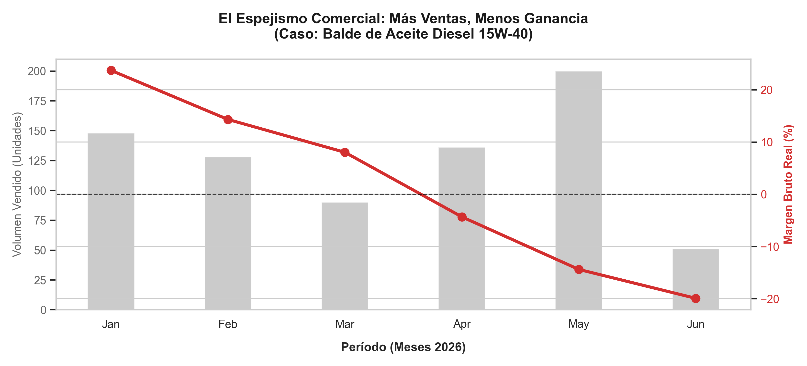
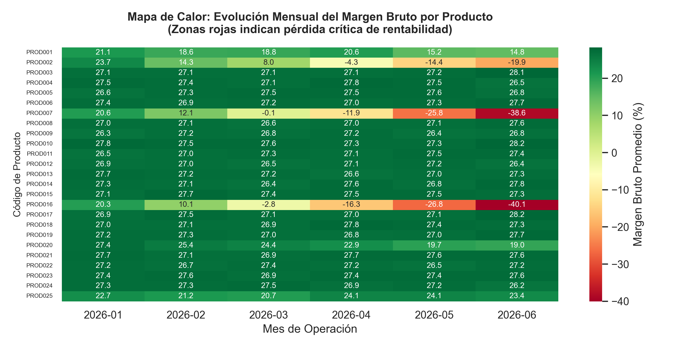
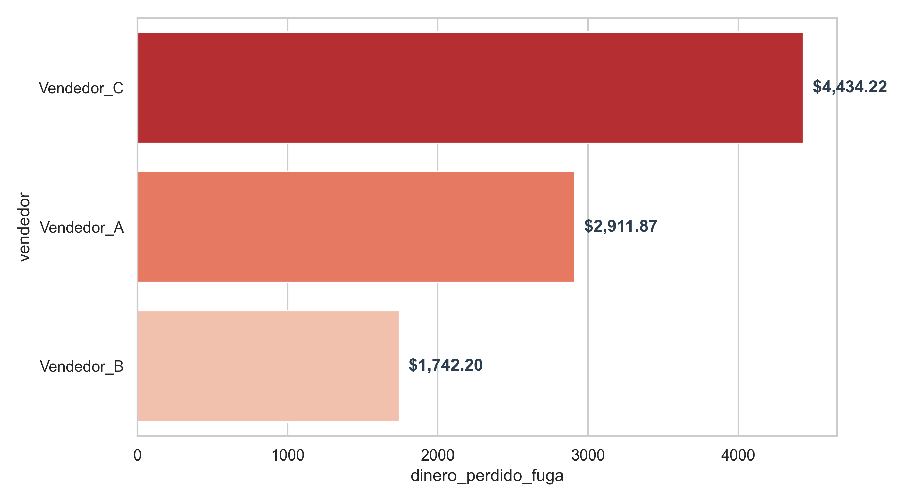

# Auditoría de Fugas Financieras:  <small>*Optimización de Márgenes y Control Operativo en Retail mediante Python.*</small>

   

## 📊 Descripción del Proyecto
En mercados de alta rotación y economías con dinámicas de costos volátiles (como el sector de lubricantes y repuestos automotrices), las Pequeñas y Medianas Empresas (PyMEs) suelen sufrir de **fugas silenciosas de capital**. Este proyecto desarrolla una solución analítica de extremo a extremo (End-to-End) que actúa como un "sabueso financiero", detectando anomalías, descapitalización por falta de indexación de costos y desviaciones en la disciplina comercial factura por factura.

El proyecto está diseñado bajo un enfoque modular utilizando **Jupyter Notebooks** en un entorno controlado dentro de **Visual Studio Code**, sirviendo como el Mínimo Producto Viable (MVP) para una solución de consultoría automatizada.

---

## 🛠️ Arquitectura de la Solución (Estructura de Cuadernos)

El ecosistema analítico está fragmentado en tres fases metodológicas independientes y reutilizables:

1. **`01_generacion_data.ipynb` (Simulación de Entorno Real):** 
   * Generación de un catálogo robusto de 25 productos base categorizados por tipo y **marca**.
   * Simulación cronológica de compras con inflación de costos no indexada (sembrada intencionalmente en 7 productos críticos).
   * Generación de un histórico masivo de ventas diarias con distorsiones comerciales: precios congelados frente a costos dinámicos (5 productos afectados) y conductas operativas de descuento sub-costo por operadores específicos.

2. **`02_analisis_margen_unitario.ipynb` (Sabueso Quirúrgico):**
   * Implementación de un algoritmo de **costeo por lote indexado en el tiempo** (Costo de Reposición Real a la fecha exacta de transacción).
   * Cálculo del Margen Bruto Unitario Dinámico línea por línea, aislando el impacto nominal del impacto real en el flujo de caja.
   * Extracción del ranking de fugas financieras con identificación directa de los responsables de la pérdida en el piso de venta.

3. **`03_analisis_mensual_agrupado.ipynb` (Análisis de Tendencia Macro):**
   * Agrupamiento mensualizado de la degradación de márgenes por artículo y marca.
   * Generación de matrices visuales de alta densidad para la toma de decisiones gerenciales.

---

## 📈 Hallazgos Visuales Clave

### 1. El Espejismo Comercial (Línea Temporal de la Portada)
Demuestra visualmente cómo el incremento en el volumen de ventas puede enmascarar una pérdida total de rentabilidad cuando los precios de venta no se indexan dinámicamente con los costos de reposición.
*(Visualización exportada en: `portada_linea_temporal.png`)*

### 2. Mapa de Calor de Degradación de Márgenes
Una matriz de densidad (`Heatmap` usando Seaborn) que evalúa los 25 productos a lo largo del tiempo. Permite a la junta directiva identificar de un solo vistazo el paso crítico de zonas de rentabilidad (verde) a zonas de pérdida de capital (rojo sangre).
*(Visualización exportada en: `heatmap_degradacion_margen.png`)*

### 3. Matriz de Disciplina Comercial
Gráfico de barras indexado que cuantifica el impacto financiero en dólares (USD) de las malas prácticas o la falta de supervisión por cada operador comercial.
*(Visualización exportada en: `ranking_vendedores.png`)*

---

## 🚀 Tecnologías Utilizadas
* **Lenguaje:** Python 3.16
* **Entorno de Desarrollo:** Visual Studio Code & Jupyter Notebooks
* **Manipulación de Datos:** Pandas, NumPy
* **Visualización Avanzada:** Matplotlib, Seaborn

---

## 🗂️ Requerimientos para Implementación en Clientes (Diagnóstico Express)
Este modelo está blindado para trabajar con datos **anonimizados** extraídos de cualquier sistema administrativo estándar (Saint, A2, Profit, SAP, etc.), requiriendo únicamente tres archivos planos (CSV/Excel) de un período de 3 meses:
* **Maestro de Artículos:** ID, Descripción, Categoría, Marca.
* **Historial de Compras:** Fecha, ID Producto, Cantidad, Costo Unitario Factura.
* **Historial de Ventas:** Nro Factura, Fecha, ID Vendedor, ID Producto, Cantidad, Precio Unitario Venta.

---
**Desarrollado por Ramón Antonio Guerra Acosta**  
*Especialista en Análisis de Datos, Optimización Operativa y Finanzas*  
📧 ramonguerraa@gmail.com
📌 El Tigre, Anzoátegui, Venezuela.